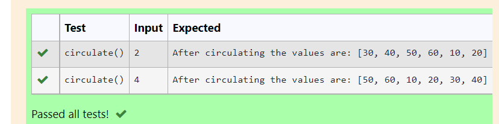
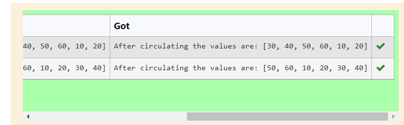

# Circulate-the-values-of-N-variables
## Aim:
To write a python program to circulate the n variables using function concept
## Equipment’s required:
PC
Anaconda - Python 3.7
## Algorithm: 
### Step 1: Start the program
### Step 2:Define the function:circulate 
### Step 3: 
Get the value from the user for the number of rotation
### Step 4: 
Using the slicing concept rotate the list

### Step 5:Then print the circulating values. 
### Step 6:End the program. 
## Program:
```
def circulate():
     l=[10,20,30,40,50,60]
     n=int(input())
     r=l[n:]+l[:n]
     print("After circulating the values are:",r)
```

## Output:



## Result:
Thus the circulating values are printed.
